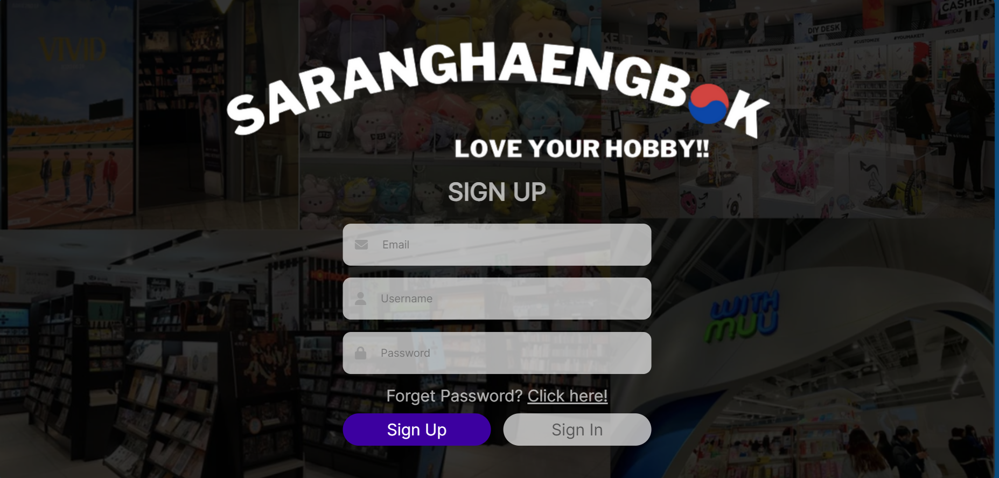
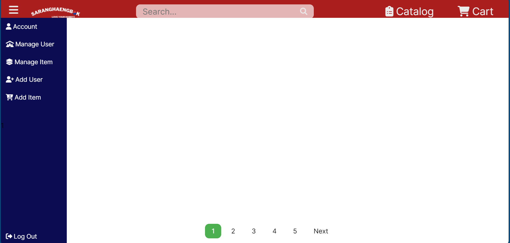

# SUBMODUL PHP APP

Repositori ini adalah submodul php-app dari Tugas Besar IF3110 Pengembangan Aplikasi Berbasis Web

## How to run
0. Clone repository submodul config dengan
```sh
git clone https://github.com/AlphaThrone/client-spa
git clone https://github.com/AlphaThrone/rest-service
git clone https://github.com/AlphaThrone/php-app
git clone https://github.com/AlphaThrone/config
git clone https://github.com/AlphaThrone/soap-service
```
1. Buka reposity **config** dan jalankan pada terminal
```sh
docker compose up --build -d
```
2. Lakukan seeding dari backend database dengan cara sebagai berikut: <br>
    1. Buka phpmyadmin <br>
    klik [disini](localhost:8080) atau akses link berikut pada browser
    ```
    localhost:8080
    ```
    2. Pilih database saranghaengbok_php
    3. Pilih import
    4. Pilih file pada direktori server/data/data+mock.sql
3. Web app bisa dijalankan dengan mengakses pada browser
```
localhost:8008
```


## Tampilan Aplikasi

<br/>
<br/> 
<br/>
<br/> 
<br>
<br/> 
<br>

## Pembagian Tugas

### Server-side
Login : 13521009, 13521012  
Register : 13521009, 13521012 
Mock datas: 13521009
Logout : 13521009
User edit profile : 13521009
User making sales : 13521009
Database Schema : 13521009
Dockerfile, docker-compose : 13521009
Catalog : 13521012
Pagination : 13521012
Search : 13521012
User Manage : 13521012
Admin User Detail (RUD) : 13521012
Transaction: 13521012

### Client-side
Login : 13521009, 13521012
Register : 13521009, 13521012 
Navigation bar : 13521012
User edit profile : 13521009
Cart : 13521009
User making sales : 13521009
Sidebar : 13521009, 13521012, 13521020
Catalog : 13521012
Pagination : 13521012
Search : 13521012
User Manage : 13521012
Admin User Detail (RUD) : 13521012
RWD : 13521012
<<<<<<< HEAD

### PHP App (Revisi / Tambahan)
Frontend Halaman Cart : 13521009
Backend Halaman Make Purchase : 13521009
Backend Create Transaction : 13521012
=======
>>>>>>> 5d9db0a9e1cfb86b9a5df7f8c57f014a3751d43b
